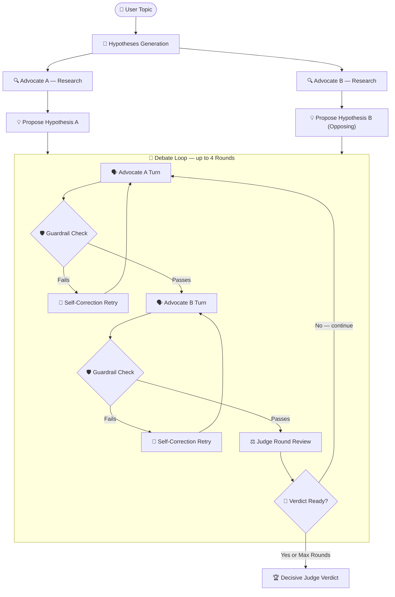

<h1 align="center">⚗️ MANTHAN — Scientific Hypothesis Debate Agent</h1>

<p align="center">
  <em>An adversarial multi-agent debate system that forces AI to argue both sides of science — with real papers.</em>
</p>

<p align="center">
  
  
  
  
  
  
</p>

<p align="center">
  Built for the <strong>AI Agents: Intensive Vibe Coding Capstone</strong>
</p>

---

## 🧠 What is MANTHAN?

> **"The truth emerges from collision, not consensus."**

AI systems that give a single confident answer to unresolved scientific questions are dangerous — they hallucinate, they oversimplify, and they mislead. **MANTHAN** takes a different approach:

Given any open scientific topic, it spawns **two adversarial AI Advocates** that independently research the literature, formulate competing hypotheses, debate each other across multiple rounds using **real, retrieved papers**, and submit to a **neutral Judge** who delivers a decisive, evidence-backed verdict.

This is adversarial debate as a framework for **honest scientific uncertainty mapping** — inspired by AI safety research on debate as an alignment technique.

---

## ✨ Key Features

| Feature | Description |
|---|---|
| 🔬 **Dynamic Hypothesis Formulation** | Both Advocates independently research the topic and propose distinct, competing scientific stances |
| 🛡️ **Hallucination Guardrails** | Every claim is programmatically verified against paper abstracts. Failed turns trigger a self-correction feedback loop (up to 2 retries) |
| ⏸️ **Interactive Intermission** | Debate pauses after Round 1 — the user injects a real challenge directive via Python coroutine `.send()` |
| 🎬 **Cinematic Typewriter Streaming** | All debate turns stream word-by-word with a live **Tug-of-War Dominance Bar** |
| ⚖️ **Decisive Dynamic Judge** | The Judge halts the debate the moment a verdict is clear — no lazy "both sides have merit" summaries |
| ⚡ **SQLite Request Caching** | All Semantic Scholar API queries are cached locally — fast, rate-limit-resistant, and fully offline-repeatable |
| 🔌 **MCP Tool Exposure** | Literature search is wrapped as a reusable Model Context Protocol tool |
| 🔄 **Swappable LLM Backends** | Switch between Gemini and Anthropic via a single `.env` variable |

---

## 📐 Agent Architecture



---

## 📂 Project Structure

```
manthan/
├── agents.py             # Advocate & Judge agent logic
├── debate_engine.py      # Orchestrator — turn-taking, retries, coroutines
├── literature_search.py  # Semantic Scholar API + SQLite cache
├── guardrails.py         # Sentence-level grounding verification
├── mcp_server.py         # Literature search as an MCP tool
├── llm_client.py         # Swappable Gemini / Anthropic backend
├── app.py                # Streamlit premium dark UI
└── tests/
    ├── test_agents.py
    ├── test_debate_engine.py
    ├── test_guardrails.py
    ├── test_literature_search.py
    ├── test_llm_client.py
    └── test_mcp_server.py
```

---

## 🏆 Course Concepts Demonstrated

| Concept | Implementation |
|---|---|
| 🤝 **Multi-agent System** | `agents.py` + `debate_engine.py` — Advocate A, Advocate B, and a decisive Judge collaborate dynamically |
| 🔌 **Model Context Protocol** | `mcp_server.py` — Literature search exposed as a reusable MCP tool |
| 🛡️ **Security & Guardrails** | `guardrails.py` — Sentence-level fact-verification with self-correction retry loops |
| 🛠️ **Clever Tool Use** | `literature_search.py` — Live Semantic Scholar API with SQLite caching & exponential backoff |
| 🔄 **Swappable LLM Clients** | `llm_client.py` — One `.env` variable switches between Gemini and Anthropic |
| ⏯️ **Python Coroutines** | `debate_engine.py` — `generator.send()` injects user directives mid-debate |

---

## 🚀 Setup & Execution

### 1. Clone & Install

```bash
git clone https://github.com/PRANJAL2208/MANTHAN.git
cd MANTHAN
pip install -r requirements.txt
```

### 2. Configure Environment

Create a `.env` file in the project root:

```env
LLM_PROVIDER=gemini           # "gemini" or "anthropic"
GEMINI_API_KEY=your_key_here
# ANTHROPIC_API_KEY=your_key_here
```

### 3. Run the Streamlit App

```bash
streamlit run app.py
```

### 4. Run the MCP Server

```bash
python mcp_server.py
```

### 5. Run the Full Test Suite *(fully offline — no API keys needed)*

```bash
# All tests
$env:PYTHONIOENCODING="utf-8"; venv\Scripts\pytest tests/ -v

# Specific module
$env:PYTHONIOENCODING="utf-8"; venv\Scripts\pytest tests/test_guardrails.py -v
```

---

## 🧩 How a Debate Runs

```
User enters topic → "Do mitochondria influence aging?"

  Advocate A researches → proposes: "Mitochondrial dysfunction drives aging"
  Advocate B researches → proposes: "Mitochondria adapt; aging is epigenetic"

  [ Round 1 ]
    A argues with 3 cited papers → Guardrail ✅
    B cross-examines and argues → Guardrail ✅
    Judge reviews → "Continue — no clear winner yet"

  *** INTERMISSION: User challenge injected → "Address model organism validity" ***

  [ Round 2 ]
    A addresses challenge → Guardrail ✅
    B counters → Guardrail ❌ → Self-correction → Guardrail ✅
    Judge reviews → "Verdict is clear — halting debate"

  VERDICT: Advocate A's position is better grounded in current literature...
```

---

<p align="center">
  Made with 🔬 for the Google AI Agents Capstone
</p>
