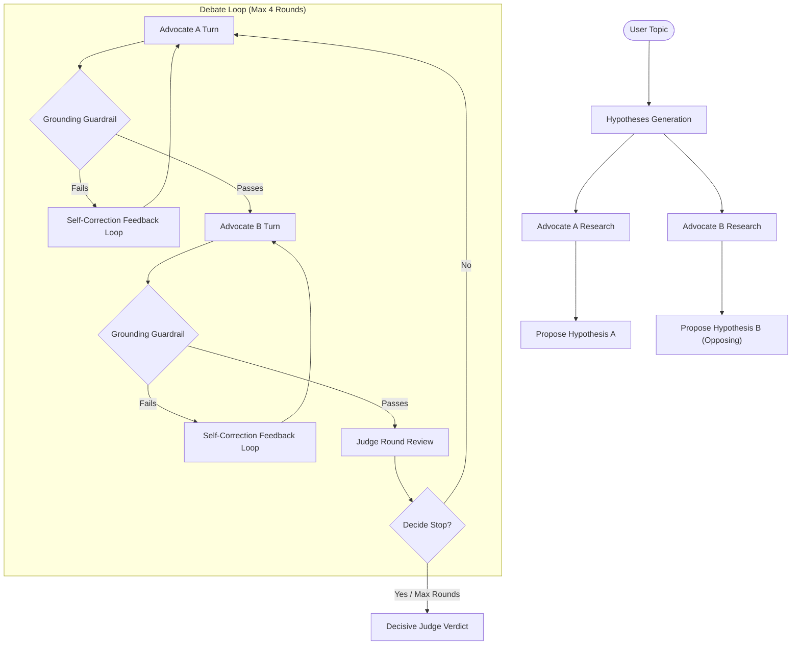

# Scientific Hypothesis Debate Agent

A multi-agent adversarial debate system that takes an open scientific topic, dynamically researches the literature, generates opposing hypotheses, advocates for each hypothesis in a structured debate using **real, retrieved scientific papers**, cross-examines the opponent's evidence, and outputs a structured scientific verdict from a neutral Judge.

Built for the **AI Agents: Intensive Vibe Coding Capstone**.

---

## 🔬 The Solution & Value

AI agents that provide a single, confident answer to unresolved questions can be misleading or hallucinate assertions. This project implements **adversarial multi-agent debate** as a framework for honest scientific uncertainty mapping, inspired by AI safety research (using debate between agents to help humans evaluate complex claims). 

### Key Architectural Enhancements
1. **Dynamic Opposite Hypothesis Formulation**: The system starts with just a topic. Advocates perform initial research and formulate competing, distinct stances.
2. **Active Self-Correction (Hallucination Prevention)**: Programmatic guardrails run on each turn. If a claim lacks abstract word overlap or references invalid indexes, the turn is rejected, and the Advocate is prompted to rewrite it using detailed feedback (up to 2 retries).
3. **Interactive Intermission & Coroutines**: The debate dynamically pauses after Round 1. The user acts as the Judge's assistant to select or type a directive (e.g. animal translation limits), which is injected into the generator via `.send()`. Advocates address this challenge directly in Round 2.
4. **Cinematic Typewriter Streaming & Tug-of-War**: Debate turns type out in real-time. A live Dominance Tug-of-War Bar shifts dynamically based on Advocates' grounding audit performances.
5. **Decisive Dynamic Stop Judge**: The Judge reviews the debate round-by-round and dynamically halts the debate when a clear verdict can be made, avoiding lazy "both are correct" summaries unless explicitly backed by different contexts (e.g. species translation).
6. **Request Latency Caching**: A local SQLite cache layer caches Semantic Scholar API queries, ensuring fast, rate-limit-resistant performance.

---

## 📐 Agent Architecture



---

## 📂 File Directory

- **`agents.py`** — Advocate and Judge agent implementations (multi-agent dynamic logic)
- **`debate_engine.py`** — Orchestrator managing dynamic loops, turn-taking, and self-correction retries
- **`literature_search.py`** — Live Semantic Scholar API tool with exponential backoff retries and SQLite caching
- **`guardrails.py`** — Security & quality guardrail (sentence-level abstract word overlap analysis)
- **`mcp_server.py`** — Literature search wrapped as a reusable Model Context Protocol (MCP) tool
- **`app.py`** — Streamlit premium dark UI
- **`llm_client.py`** — Swappable LLM client backend (Gemini default, Anthropic fallback)
- **`tests/test_debate_engine.py`** — Unit tests covering grounding checks, signature changes, and mock JSON-based runs

---

## 🏆 Course Concepts Demonstrated

| Course Concept | Where & How |
|---|---|
| **Multi-agent System (ADK)** | `agents.py` + `debate_engine.py` — Dynamic collaboration between `Advocate A`, `Advocate B`, and a decisive `JudgeAgent`. |
| **Model Context Protocol (MCP)** | `mcp_server.py` — Reusable MCP tool wrapping Semantic Scholar literature searches. |
| **Security & Guardrails** | `guardrails.py` — Programmatic sentence-level fact-verification with self-correction retry feedback loops. |
| **Clever Tool Use** | `literature_search.py` — Live API search with caching in local SQLite (`.search_cache.db`) and robust retry-on-failure backoff. |
| **Swappable LLM Clients** | `llm_client.py` — Centrally manages swappable Gemini & Anthropic model configurations. |

---

## 🚀 Setup & Execution

### 1. Installation
Install the required dependencies inside your environment:
```bash
pip install -r requirements.txt
```

### 2. Environment Configuration
Create a `.env` file in the project root:
```env
LLM_PROVIDER=gemini          # "gemini" or "anthropic"
GEMINI_API_KEY=your_gemini_key_here
# ANTHROPIC_API_KEY=your_anthropic_key_here
```

### 3. Running the Streamlit App
Start the premium web interface:
```bash
streamlit run app.py
```

### 4. Running the MCP Server
Expose the literature search tools over standard MCP:
```bash
python mcp_server.py
```

### 5. Running the Test Suite
Ensure the code passes all unit tests offline (fully mocked, no network or API keys required):
```bash
# Run the entire test suite
$env:PYTHONIOENCODING="utf-8"; venv\Scripts\pytest tests/ -v

# Run a specific module's test suite
$env:PYTHONIOENCODING="utf-8"; venv\Scripts\pytest tests/test_llm_client.py -v
```
